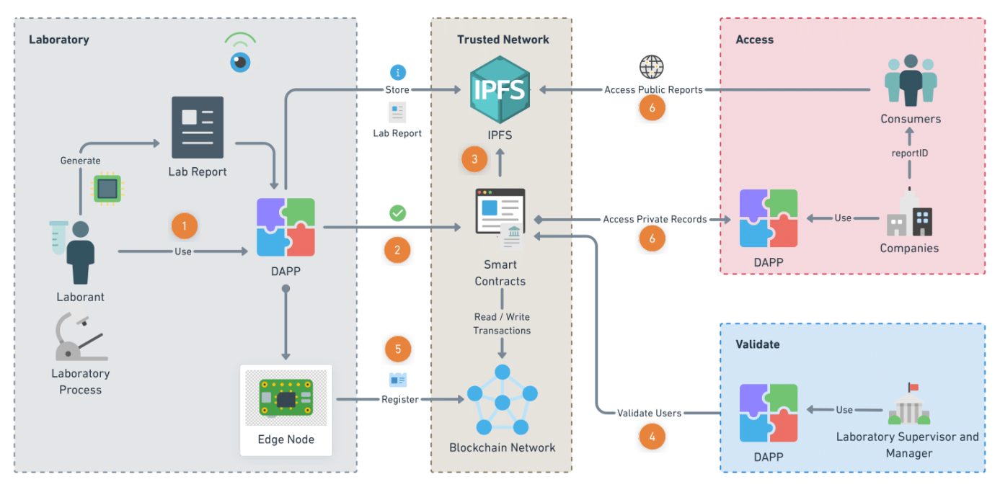

# Blockchain-based decentralized lab report process framework

This study aims to develop a framework of a decentralized lab report process system to enhance the transparency and trust of the lab test reports by using blockchain technology. In this study, Quorum is selected as the blockchain framework and the Raft consensus protocol is used for an energy-efficient blockchain solution. Smart contracts are used as the autonomous code of the system. Transaction and contract privacy is used to handle the privacy issues. IPFS provides a scalable and sustainable distributed file system. The framework demonstrates the lab report traceability, tamper-proof documents at a low cost, and less human error. It will make sharing of lab test results reliable and verifiable between laboratories, companies, consumers, and authorities.  

Figure 1:   

